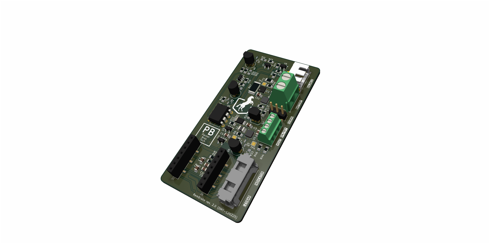
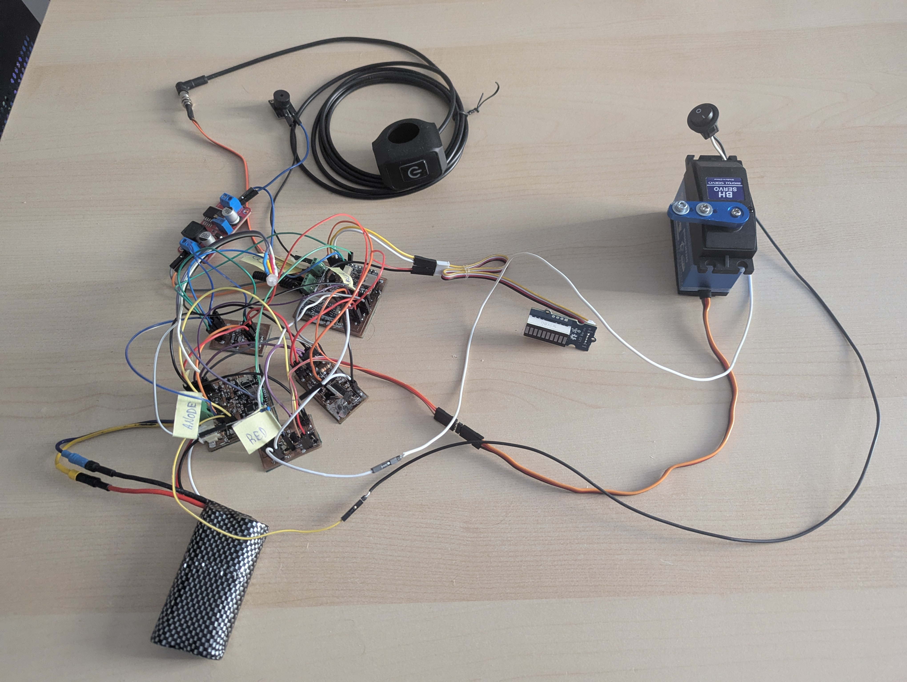
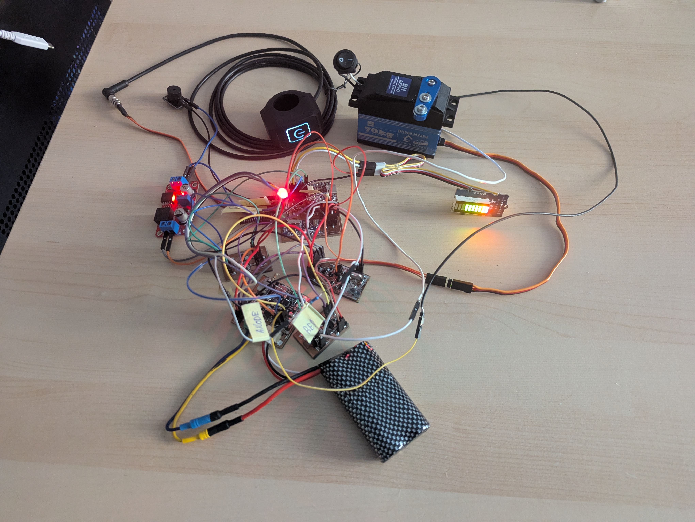

# RemBrake - remote brake system for handbikes 

## Introduction
- TODO explain what the RemBrake, why we decided to create this project

### Assembling RemBrake
- TODO explain how to use the kicad data
- TODO how to solder the modules on the RemBrake PCB
- TODO how to connect the wires

## Notes
* Pay attention that all the connectors are well soldered to the board.

### Prepare the module 
1) load the circuitpython to the QT Py RP2040
2) press and hold BOOT button and then press RST button
3) you should see now RPI partition mounted to your PC 
4) download CircuitPython bootloader (.uf2 file) from [circuitpython.org](https://circuitpython.org/board/adafruit_qtpy_rp2040/) 
5) drag and drop the file onto the partition
6) it takes few moments and you should see your partition name turn to CIRCUITPYTHON

### Upload RemBrake files + necessary modules
1) go to the folder fw folder
2) run $ make prepare
3) move the folder target to your CIRCPITPYTHON partition

## Features
- TODO how the PCB behaves (charging, running, error)
- TODO what the different colors mean

## About the system
### System's Block Diagram (BD) 
### System's Finite State Machine (FSM)

## Possible further development
- Bidirectional remote contoller that the assistant can see the battery status
- Accelerometer feedback, to adjust braking power according to the situation
- Using hydraulic piston actuator to move with the brake directly, which could shrink significantly the size of the package
- designing custom usb-c charger to avoid the hustle with unprecise power management of the chinese module

## Development

# ISSUES 
## Hardware
* When the brake power is cut, the display turns off but the shift register
inside stays powered enough to retain its latched state; as a result, when the
LED bar is powered again it lights from the old data and continues glowing for
up to 8s.
* The transition from charging to running is too slow, so reverse current is
feeding the base of the state-switching transistor and back-driving it;
swapping in a Schottky diode (or regular diode) with a higher forward drop
would block that reverse current and fix the issue.
